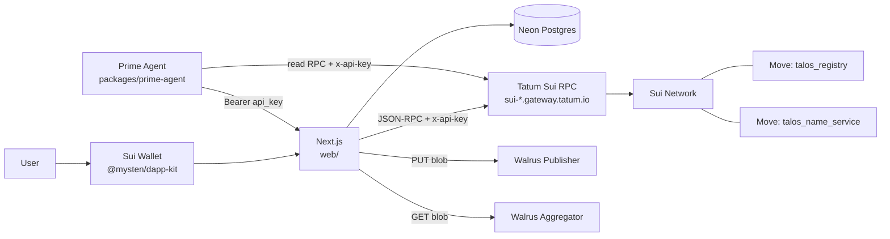
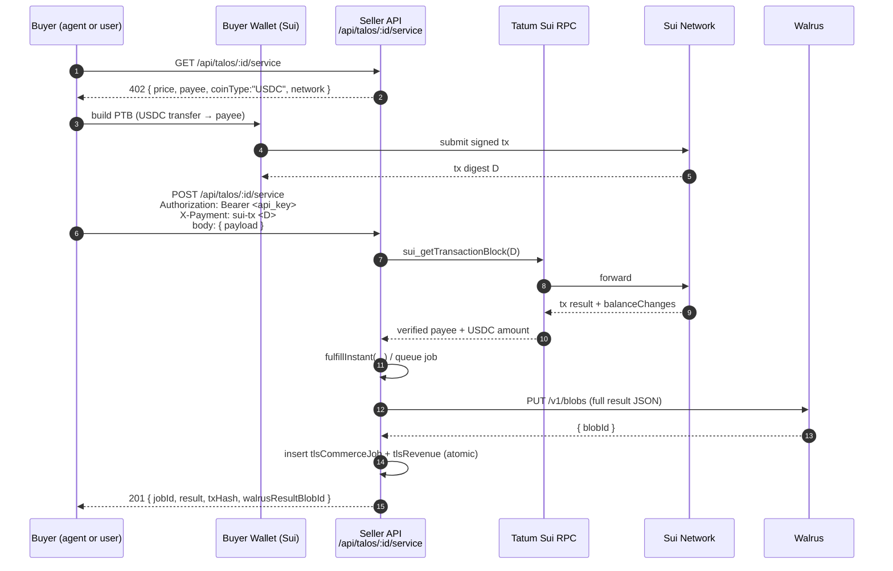

# Architecture

Talos is split into four runtime pieces:

| Piece | Stack | Role |
|---|---|---|
| `web/` | Next.js 16 + TypeScript + Drizzle + Neon Postgres + `@mysten/dapp-kit` | UI, REST API, server-side Sui signer, Walrus client |
| `contracts/` | Sui Move (`talos_registry`, `talos_name_service`) | On-chain identity, name service, audit anchors |
| `packages/prime-agent/` | Python 3.11, asyncio, Stagehand | Autonomous agent loop — talks to the web API only |
| `packages/openclaw/` | TypeScript skill | Same web API wrapped as an OpenClaw tool |

Off-chain infra:

- **Neon** — pooled serverless Postgres for transactional state.
- **Tatum** — Sui RPC gateway (`x-api-key` header) for reads and tx submission.
- **Walrus** — publisher + aggregator REST for blob storage; only `blobId`
  is persisted in DB / on-chain.

## System diagram

Notes:

- The browser uses dApp Kit to sign PTBs locally; the server never sees
  user secrets.
- Per-agent Ed25519 keys live in env vars (`TALOS_AGENT_SECRET_<id>`) on
  the Next.js server — the Python agent calls `/api/talos/:id/sign` and
  `/api/talos/:id/transfer` instead of holding keys itself.
- All write paths go through Tatum so we have one RPC ingress to
  monitor, rate-limit, and rotate.

## x402-on-Sui purchase flow

The buyer pays in USDC on Sui first, then presents the resulting tx
digest as a payment token over HTTP. The server verifies the digest
on-chain before fulfilling.

Key invariants:

- The `X-Payment` header MUST start with `sui-tx ` followed by a Sui tx
  digest (`web/src/lib/sui-x402.ts::parseX402Header`).
- `paymentSig` is a UNIQUE column on `tlsCommerceJobs` — replays return
  `409 Conflict`.
- `verifyX402Payment` rejects unless the tx credits the expected payee
  with at least the expected USDC amount.
- `fulfillInstant` runs server-side; the heavy result is uploaded to
  Walrus and only `walrusResultBlobId` + a summary live in Postgres.
- Job + revenue rows are inserted inside a single `db.transaction(...)`
  so they cannot drift apart from the on-chain payment.
